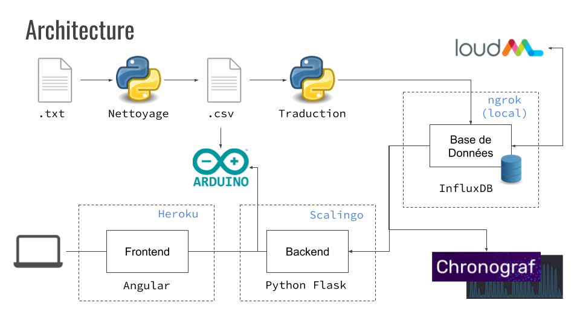

# Projet Lapin 2020

#### [Vidéo Pitch Présentation](https://www.youtube.com/watch?v=5mi0oyz8Dks) | [Vidéo Demo](https://www.youtube.com/watch?v=I_x9ePzZfyA)

Bienvenue au dépôt GitHub du Projet Lapin 2020-2021 ! Le travail (et le dépôt) a été divisé en quatre subparties :
- Traitement de données
- Génération
- Arduino
- Interface

Il y a encore un dossier avec des documents produits pendant le projet, un rapport final inclus.

## Vision Générale

Pour ce project, des fichiers des données brutes sont traités par des programmes python développés par le sous-groupe de traitement de données. Le traitement consiste dans le nettoyage et la correction des valeurs aberrantes. Le résultat est un ensemble de fichiers CSV utilisés par un autre programme python pour réaliser la création et structuration d'une base de données sur InfluxDB.

Ensuite, LoudML est connecté à la base de données InfluxDB. Des modèles sont créés et entraînés avec les données de la base. Une fois entraînés, les modèles sont utilisés pour générer des nouvelles données.

Toutes les données disponibles sur InfluxDB peuvent être visualisées et analysées avec l'outil graphique Chronograf. Un backend en python a aussi été développé pour obtenir les données dans la base et les fournir à une interface web (frontend développée en Angular) et à l'Arduino. Pour ce connecter au backend, l'Arduino dispose d'un programme python. Il est aussi possible d'alimenter l'Arduino directement avec les données provenantes des CSV en utilisant un autre programme python.

Pour disponibiliser dans le cloud la solution, des containers de backend et frontend dans des services comme Heroku et Scalingo ont été mis en place. Le service ngrok a été utilisé pour exposer dans l'internet les bases de données exécutés localement.

